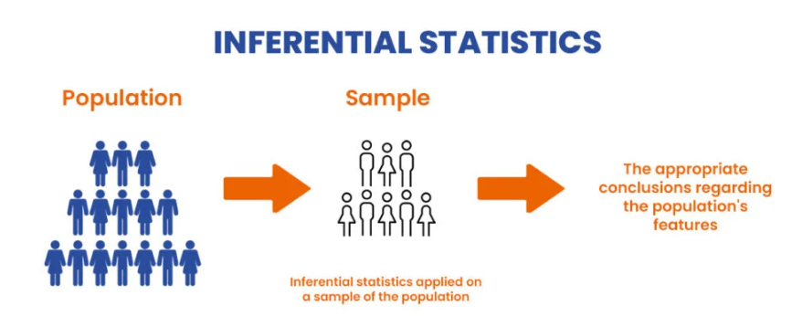
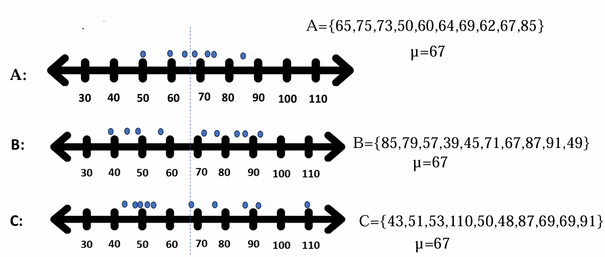
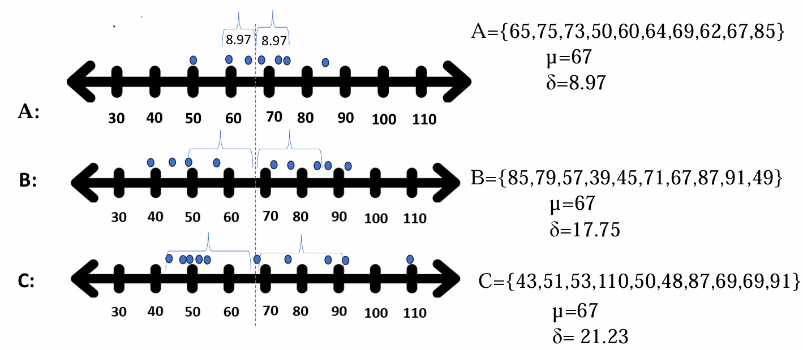
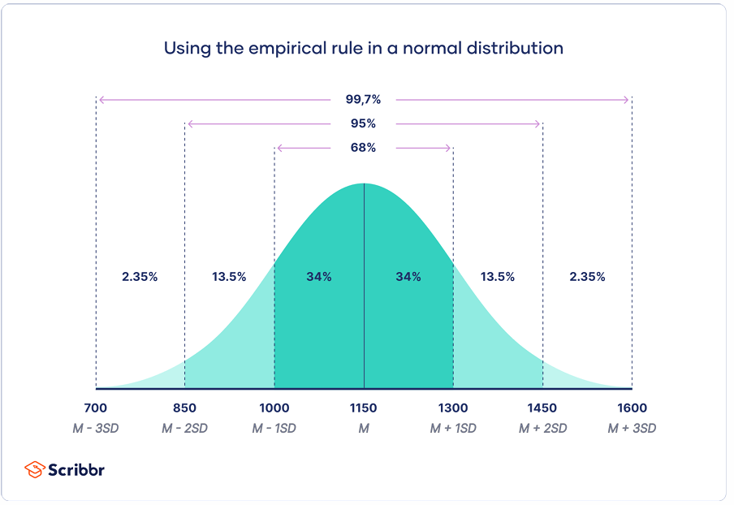

# 🎓 Recitation #6 – MITx 6.00.2x

## 🧭 Topic:Inferential Statistics & Probability

## 📘 Overview

This session introduces essential statistical concepts for understanding how data varies, how we can make predictions based on samples, and how to analyze that variation using mean, standard deviation, confidence intervals, and sampling distributions.

---

## 📊 1. Inferential Statistics

- Use sample data to make generalizations about a population.
- Helps with estimating unknown parameters (e.g., population mean) and testing hypotheses.
- Based on **random sampling** and **probability theory**.

**Why it Matters**

- Think of this as making a smart guess about something big (the population) by only looking at a small part (a sample).
- Example: You don’t know everyone’s opinion in a country, but you ask 1000 people in a survey and use that to guess what the whole population might think.
- It’s powerful but risky — that’s why we need probability to estimate how confident we are in our guesses.

  

---

## 📈 2. Law of Large Numbers (LLN)

- The more trials you run, the closer your **empirical (observed)** probability will approach the **theoretical** one.
- Example: flipping a coin 10 times vs. 1000 times — the proportion of heads will stabilize around 0.5 as trials increase.

**Why it Matters**

- At first, results can be random and unstable (e.g., 7 heads, 3 tails in 10 coin flips).
- But as the number of trials increases, the results become more stable and start to reflect the true probability (e.g., ~50% heads over 1000 flips).
- Analogy: When tasting soup, one spoon might not give the full flavor, but repeated spoons help you better understand the whole pot.

---

## 📉 3. Regression to the Mean

> **Real-life example (student-focused)**:  
> A student scores **very low** on their first exam. Due to effort or natural variation, they are likely to score **closer to average** on the second exam.  
> Similarly, an **extremely high** score may be followed by a more average one.  
> This is **not** because performance must balance out — it's a statistical tendency for extreme outcomes to move toward the mean over time.
> Use this to warn against overreacting to one-time extreme events (like hiring only top performers or firing someone after one bad day).

**Why it Matters**

- Not a magical force — it’s a statistical pattern.
- When someone does unusually well or poorly, their next performance is more likely to be closer to their average, not because they’re getting better or worse, but because the extreme result probably included some luck (positive or negative).

- Student example: A student who gets 10/100 might just have had a bad day. Their next score is likely to go up — not because the test is easier, but because 10 was far from their normal range.

### ⚠️ Don’t confuse with **Gambler’s Fallacy**:
### 📌 Gambler’s Fallacy vs. Regression to the Mean

| Aspect                | Gambler’s Fallacy                                     | Regression to the Mean                                                      |
|-----------------------|--------------------------------------------------------|------------------------------------------------------------------------------|
| **Based on**          | A *false belief* about randomness                      | A *true statistical pattern*                                                |
| **Applies to**        | Independent events (like coin flips)                   | Repeated measurements of the same thing (e.g., skill, performance)          |
| **Why shift happens** | Belief that randomness “owes” a correction             | Extreme results usually contain random noise, so future results average out |
| **Example**           | Thinking tails is “due” after 5 heads                  | A sick person tested on a really bad day is likely to do better next time   |

---
## 📐 4. Variation in Data: Why It Matters

> **How variable is the data?**

Some datasets are tightly clustered around the mean (**low variation**), while others are widely spread out (**high variation**). Even if two datasets have the same average, the **spread** tells us how **reliable** that average is.

### 🧠 Why Should We Care About Variation?

- **More variation** → less reliable the mean estimate from a small sample  
- **Smaller variation** → faster convergence to the true mean (better stability)

> If your data is very spread out, a single sample may not represent the population well.

### 🏠 Real-Life Analogy: Room Temperature

Imagine two rooms with the **same average temperature (22°C)**:

- Room A: every day is between 21–23°C (low variation)
- Room B: some days are 10°C, others are 34°C (high variation)

> Both have the same average — but Room B is **much more unpredictable**. That’s what high variance looks like.

## 🔍 What Is Variance?

Variance measures how **spread out** your data is from the mean.  
It’s the **average of the squared distances** from the mean.

### 📌 Formula (Used in This Course):

Variance = (1 / n) * Σ(xᵢ − 𝑥̄)²  
Standard Deviation = √Variance

Where:
- `xᵢ` = each value in the dataset  
- `𝑥̄` = the mean of the dataset  
- `n` = number of data points  
- `Σ` = sum over all data points

### 🧮 Why Square the Differences?

- To **avoid negative values** canceling out positive ones
- To emphasize **larger deviations**
- 

## 📏 From Variance to Standard Deviation (SD)

- **SD = √Variance**
- SD is more interpretable because it's in the **same unit** as the original data (e.g., points, dollars, degrees)

### ❗ Note for Learners

In real-world statistics, we divide by **(n - 1)** when calculating sample variance (this is called **Bessel’s correction**) to avoid underestimating the true population variability.

> But in this course, we usually work with **full datasets or simulations**, so we use the **simplified version with `n`**.

### 💬 In Summary:

- Variance tells us **how much our data moves away from the mean**
- It's the **first step** toward understanding uncertainty, sampling reliability, and confidence

---

## 📊 5. Mean and Standard Deviation

- **Mean (µ)**: average value of a dataset.
- **Standard Deviation (σ)**: how far data values are spread around the mean.
  - Low SD → data is clustered
  - High SD → data is spread out

---

---

## 🔄 6. Coefficient of Variation (CV)

- The **Coefficient of Variation (CV)** measures how much variability exists in relation to the mean:

 **CV = Standard Deviation / Mean**
- **Dimensionless** (no units) → useful for comparing variability across datasets with different scales.
- - A **high CV** means the data is highly spread out relative to the mean.
- A **low CV** means the data is more consistent and concentrated around the mean.
- Example:
  - Data A: Mean = 50, SD = 5 → CV = 0.1
  - Data B: Mean = 100, SD = 10 → CV = 0.1
  - Equal relative variation, even though absolute SD differs.

 **Why it Matters**
 - When comparing two datasets with very different scales, SD alone can be misleading.
 - CV = SD / Mean lets you compare variability as a percentage of the mean.
 - Example:
   - Dataset A: Mean = 10, SD = 2 → CV = 0.2 → 20% variation
   - Dataset B: Mean = 1000, SD = 50 → CV = 0.05 → only 5% variation
  - Use when:
    - Comparing salaries across countries
    - Comparing variability in different units (test scores vs. product quality)

---

## 🧪 7. Confidence Interval (CI)

- Provides a **range of values** that likely includes the population parameter.
- Based on **sampling variability**.
- Common CI: 95% → "We are 95% confident that the population mean lies within this range."

**Why it Matters**

- A confidence interval tells you:
  - “We’re X% confident that the true average lies between here and here.”
- It reflects uncertainty from sampling.
- A 95% CI means: If we repeat this sampling process 100 times, about 95 of the intervals will contain the true population mean.
- Wider interval = more uncertainty (small sample, high variation)
- Narrower interval = more confidence (large sample, low variation)
---

 ### 🔗 Relationship Between Coefficient of Variation (CV) and Confidence in Sampling

Although CV and confidence intervals are different tools, they are **conceptually connected** through the idea of **variation and reliability in estimation**.

### 📊 Connection to Confidence Intervals

| Scenario         | Description                                                  | Confidence Interval Impact             |
|------------------|--------------------------------------------------------------|----------------------------------------|
| **High CV**      | High relative variation in the data                          | Greater uncertainty → CI is wider      |
| **Low CV**       | Low variation compared to the mean                           | More stable estimates → CI is narrower |
| **Same CV, Larger Sample** | Larger sample helps reduce error                    | CI becomes narrower                    |

### 🧠 Conceptual Relationship

- **CV reflects the underlying variability in the population**.
- When CV is high, **individual samples are more likely to fluctuate**, which reduces your **confidence** in how well any one sample represents the population.
- This means your **confidence interval will be wider**, unless you compensate with a **larger sample size**.
- When CV is low, sampling results are more stable → **more precise estimates** with **smaller samples**.

### 💡 Summary 

> **CV tells us how variable the data is, relative to its size.**  
> When CV is high, we need **larger samples** to reach the same level of confidence in our results.  
> So, **higher CV = lower sampling confidence unless sample size increases.**

---
### 📦 8. Types of Data Distributions

| Distribution Type | Shape         | Example                            | Real-World Insight                                  |
|-------------------|---------------|-------------------------------------|-----------------------------------------------------|
| **Uniform**       | Flat/Rectangular | Rolling a fair die                 | Every outcome is equally likely                     |
| **Normal**        | Bell-shaped   | Heights, test scores, IQ scores     | Most values are near the mean; fewer at extremes    |
| **Skewed Right**  | Long tail to the right | Income distribution               | Most values are low, a few are very high            |
| **Skewed Left**   | Long tail to the left  | Retirement age, death rates       | Most values are high, a few are very low            |
| **Exponential**   | Rapid decay   | Time between arrivals or decays     | Many short durations, few long ones                 |

Understanding distribution shape helps determine which tools (e.g., CI, SD) are appropriate.

---

## 📏 9. Empirical Rule (for Normal Distribution)

- 68% of values fall within **±1 SD**
- 95% within **±2 SD**
- 99.7% within **±3 SD**

Helps to construct confidence intervals and interpret normal distributions.

**Why it Matters**
- Applies when data is normally distributed (bell-shaped).
- Visual rule of thumb:
  - 68% of data falls within 1 SD
  - 95% within 2 SD
  - 99.7% within 3 SD
- Useful for checking if a data point is “unusual.”

- Example: If test scores have a mean of 70 and SD of 10:
  - 95% of scores fall between 50 and 90
 

---

## 📌 Summary 

- Sampling introduces uncertainty — **we need tools like SD, CI, and CV** to quantify it.
- **Larger samples** reduce uncertainty.
- **Extreme results are likely to normalize** over repeated measurements (regression to the mean).
- **Visualizing distributions** helps us make better inferences from data.

---

> 📢 *Next up*: Apply these ideas in code! Open the activity notebook to simulate sampling and visualize results.
