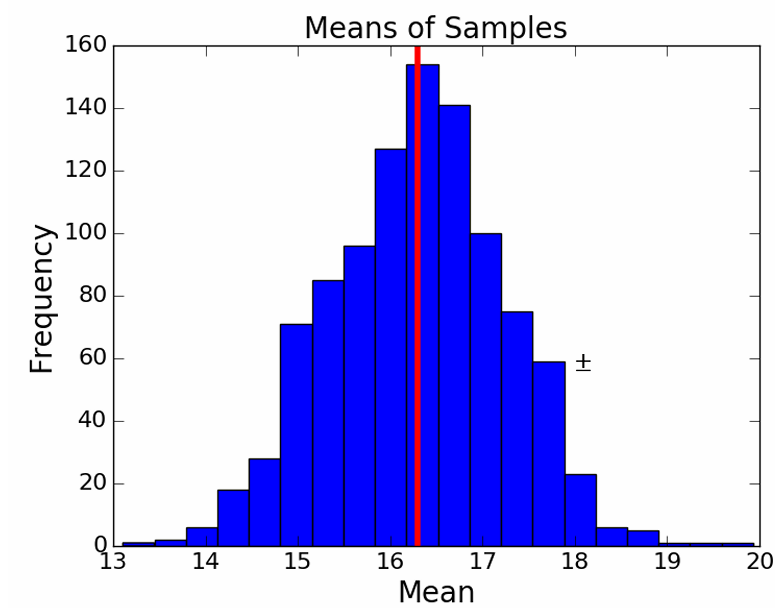

# 📘 Sampling, Standard Error, and Confidence Intervals

## 🎯 Learning Objectives
- Understand why a single sample can still be useful for inference if it is random and sufficiently large.
- Explain how **standard error** relates to sample size and variability in sample means.
- Use Python simulations to visualize how sample means are distributed and how confidence intervals change.
- Interpret histograms and error bars as tools for statistical reasoning.

---

## 🧪 Part 1: Is One Sample Enough?

In Segment 1, we saw that a single random sample happened to have a mean and standard deviation close to the population's. In Segment 2, we test if this was **luck or something predictable**.

We use the Central Limit Theorem (CLT):

> When we take many random samples, their means form a normal distribution centered around the true population mean.

```python
population = getHighs()
sampleSize = 200
numSamples = 1000
sampleMeans = []

for i in range(numSamples):
    sample = random.sample(population, sampleSize)
    sampleMeans.append(sum(sample) / len(sample))
```

Here, we take 1000 random samples (each size 200) from real temperature data and store their means.

---

## 📊 Part 2: Visualizing Sample Means and the Population Mean

We now plot the distribution of sample means and compare it to the true population mean:

```python
makeHist(sampleMeans, 'Means of Samples', 'Mean', 'Frequency')
pylab.axvline(x=popMean, color='r')  # Red line shows the population mean
```

<p align="center">
  
</p

This histogram shows:
- Sample means form a **bell-shaped curve**
- The red line (population mean) lies near the center
- This confirms what the CLT predicts

---

## 🧮 Part 3: Standard Error – How Much Do Sample Means Vary?

Next, we measure how *spread out* the sample means are:

```python
print('Standard deviation of sample means =', round(numpy.std(sampleMeans), 3))
```

This value is the **standard error (SE)**:

> A smaller SE means the sample mean is more tightly clustered around the population mean.

We also track the maximum deviation between sample and population stats:

```python
print('Maximum difference in means =', round(maxMeanDiff, 3))
print('Maximum difference in standard deviations =', round(maxSDDiff, 3))
```

---

## 📉 Part 4: Error Bars and Confidence Intervals

What happens when we increase **sample size**? Does it improve accuracy?

This function simulates multiple sample sizes and visualizes their 95% confidence intervals:

```python
def showErrorBars(population, sizes, numTrials):
    ...
    pylab.errorbar(xVals, sizeMeans,
                   yerr=1.96 * pylab.array(sizeSDs), fmt='o',
                   label='95% Confidence Interval')
    ...
    pylab.axhline(y=popMean, color='r', label='Population Mean')
```

To run the visualization:

```python
showErrorBars(population, (50, 100, 200, 300, 400, 500, 600), 50)
```

📌 You will observe:
- All sample means stay close to the red population line.
- **Larger sample sizes** → **narrower error bars** → **more precise estimates**

---

## ✅ Key Takeaways

| Concept               | Why It Matters                                                   |
|-----------------------|------------------------------------------------------------------|
| Sample Mean           | Used to estimate the population mean                            |
| Standard Error (SE)   | Measures variability of sample means                            |
| Confidence Interval   | Tells how sure we are about our estimate                        |
| Larger Sample Size    | Decreases SE and narrows confidence intervals                   |
| Central Limit Theorem | Explains why sample means form a normal distribution            |

---

### 📌 *How can we trust one sample? What can go wrong?*

---

## 1️⃣ Using One Sample to Estimate the Population Mean

In Segment 2, we saw how *many* random samples gave us a reliable average close to the true population mean.  
But in real life, we often don’t get 1,000 samples — we get **just one**.

So the question is:  
**Can we use just one sample to estimate the population mean and say how confident we are?**

✅ Yes — thanks to the **Central Limit Theorem** and a simple idea called the **Standard Error (SE)**.

---

### 🔍 What is Standard Error?

It tells us **how much the sample mean might vary** from the true population mean.

We estimate it using this formula:

```
Standard Error (SE) ≈ sample standard deviation / sqrt(n)
```

- `n` = sample size  
- The larger the sample, the **smaller** the SE  
- This lets us build a **confidence interval**:  
  > “We are 95% confident that the population mean lies within ±1.96×SE of our sample mean.”

---

## 2️⃣ The Shape of the Data Matters (Skew Warning)

Some datasets are **symmetric** (like height or test scores). Others are **skewed** (like income or wait times).

Here’s the key idea:

> If your data is **heavily skewed**, you’ll need a **larger sample size** to get a good estimate.

✅ For symmetric data:
- Even small samples work fine
- Your SE estimate (and confidence interval) will be accurate

⚠️ For skewed data:
- Small samples give **unreliable SE**
- You might **underestimate or overestimate** your confidence

**Rule of thumb**: the more skewed the population, the larger your sample should be.

---

## 3️⃣ Why Random and Independent Sampling Matters

Suppose you’re working with a large dataset (like daily temperatures from different cities). You want to take a sample of 200 values.

You might think:  
> “Let me pick a random starting point in the file and just take the next 200 rows.”

But here’s the problem:  
These 200 rows might **not be independent**. For example, they could all come from **one city** (like Phoenix), because the dataset is grouped by location.

📉 In an experiment:
- Random sampling (using `random.sample`) gave **good results**: 95% of sample means stayed within the 95% confidence interval.
- But when they sampled **200 consecutive rows** from a random point in the file, the result was **very wrong** — only about 7% of the means were inside the expected range.

> This happened because the samples were **not independent** — they came from the same location and had similar temperatures.

---

### 🔍 So what should we do if the data is grouped?

If you know the data is grouped (e.g., by city or age), don’t just use simple random sampling blindly.

✅ You can use **stratified sampling** — a method where you:
- Split the data into groups (like cities),
- Then randomly select samples **from each group**,
- Usually in proportion to their size.

This ensures that **every group is fairly represented** and avoids biased or misleading results.

