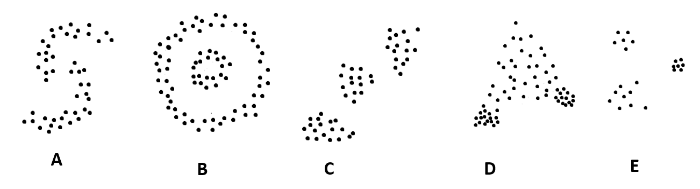

## 🔍 Activity: Will K-Means Match the Pattern?

K-means is a **greedy algorithm**, meaning it always chooses the nearest points to the current centroids. Because it tries to minimize the distance (dissimilarity) between points and their assigned centroid, it may **get stuck in a local minimum** — a solution that looks good nearby but isn't actually the best overall.

In this activity, we’ll use your understanding from the lecture to answer:

### ❓ Question:
> Will k-means, using **Euclidean distance**, be able to find clusters that match the patterns in each dataset shown below?

---

### ✅ What To Do:

For each dataset (A–E), answer the following:

1. **Do you think k-means will correctly find the natural clusters?**  
   (Yes / No)

2. **Why or why not?**  
   Think about whether the pattern:
   - Forms **blobs** vs **shapes or curves**
   - Has **clearly separated groups** or **nested/irregular structure**
  

---

You do not need to be "correct" — this is about practicing your reasoning based on what we learned. We’ll discuss the answers together!

### 💡 Remember:
- K-means works best when clusters are **spherical and evenly spaced**.
- It **may not work well** if clusters are oddly shaped or overlapping.

  
</p
