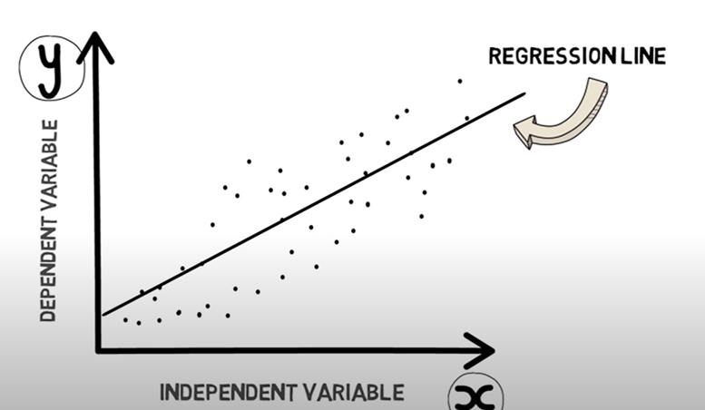

# Linear Regression 

---

## 1. Introduction to Linear Regression

**Linear Regression** is a statistical method used to model the relationship between:
- A **dependent** variable (the one we want to predict)
- One or more **independent** variables (used to make predictions)

**Definition:** Linear regression aims to find the **best-fitting** linear equation that describes the relationship:

```
y = a * x + b
```

Where:
- `a` is the **slope** (effect of `x` on `y`)
- `b` is the **intercept** (value of `y` when `x = 0`)

---

## 2. Visual Representation

 <p align="center">
  
</p>

- `y`: the dependent variable (target/prediction)
- `x`: the independent variable (input/feature)
- The **regression line** shows the predicted values

---

## 3. Real-world Example

**Use case:** Predicting exam scores based on study hours

- Input: Hours studied (independent variable `x`)
- Output: Exam score (dependent variable `y`)
- Model form: `Exam Score = 5 * Hours Studied + 70`
- Example prediction: If a student studies 8 hours:

```
y = 5 * 8 + 70 = 110
```

---

## 4. Curve Fitting and Least Squares

When fitting a curve:
- We map inputs `x` to outputs `y`
- The **accuracy** of the fit is measured by how close predictions are to real values
- The **least squares method** is most common

**Error formula:**
```
Sum over all i: (observed[i] - predicted[i])^2
```

---

## 5. Visualizing Least Squares

- Each vertical line = error for one point
- Best-fit line minimizes the **sum of squared errors**
- Less total squared error = better model

---

## 6. Polynomial Fitting with Least Squares

Linear regression is a special case of polynomial fitting:
- You can fit polynomials of **degree n**
- Still using least squares to find best coefficients

Example:
```
y = a * x + b  # linear
```

---

## 7. Mean Squared Error (MSE)

**MSE** is a metric to evaluate model performance:

```
MSE = (1/n) * Sum( (actual - predicted)^2 )
```

- Lower MSE means better predictive accuracy
- Often used to compare models

**Python example:**
```python
def aveMeanSquareError(data, predicted):
    error = 0.0
    for i in range(len(data)):
        error += (data[i] - predicted[i])**2
    return error / len(data)
```

---

## 8. R-squared (R2)

- Another performance metric, also called **coefficient of determination**
- Measures **how much variance** in `y` is explained by the model
- Ranges from 0 to 1:
  - 1 = perfect prediction
  - 0 = model explains nothing
- Note: **Higher R2 is not always better** due to overfitting

---

## 9. Overfitting

- Overfitting happens when the model captures **noise** instead of **true patterns**
- Often caused by overly complex models (e.g. high-degree polynomials)

**Example from mystery data:**
```python
def genNoisyParabolicData(a, b, c, xVals, fName):
    yVals = []
    for x in xVals:
        theoreticalVal = a*x**2 + b*x + c
        yVals.append(theoreticalVal + random.gauss(0, 35))
    f = open(fName,'w')
    f.write('x        y\n')
    for i in range(len(yVals)):
        f.write(str(yVals[i]) + ' ' + str(xVals[i]) + '\n')
    f.close()
```

**Plotting R2 across increasing polynomial degrees:**
- Degree 2: R2 ≈ 0.86
- Degree 16: R2 ≈ 0.996 → likely overfitting

---

## Key Takeaways

- Use linear regression to model relationships and make predictions
- Always validate fit using MSE and R2
- Watch for overfitting in complex models
- Simpler models often generalize better
