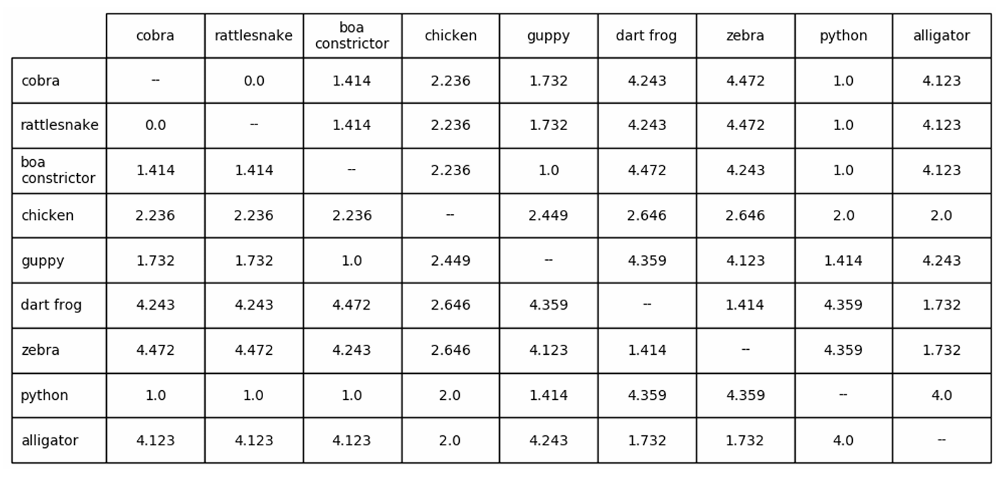
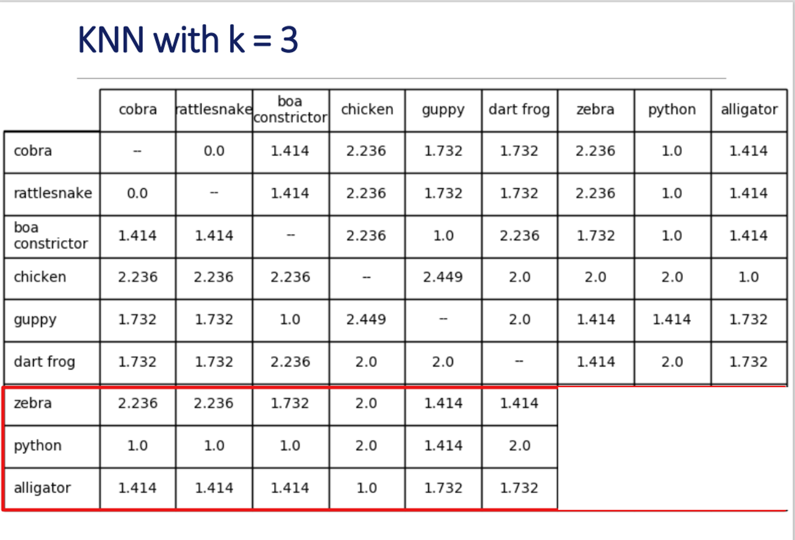
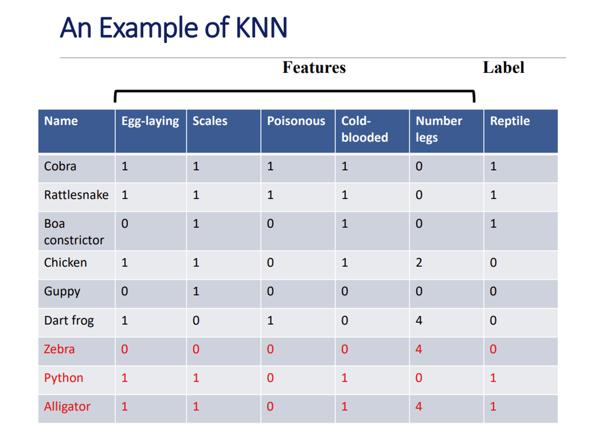

# 🤖 Lecture 12: Introduction to Machine Learning

This lecture provides a conceptual overview of **Machine Learning (ML)**, one of the most significant areas in modern computer science. The aim is not to teach ML in depth, but to introduce key ideas and spark curiosity for further study.

---

## 🎯 What is Machine Learning?

> "Machine learning is the field of study that gives computers the ability to learn without being explicitly programmed." – *Arthur Samuel*

### 🧠 Human Learning Analogy
| Human Learning     | Machine Learning Equivalent         |
|--------------------|--------------------------------------|
| Memorization       | Storing exact examples               |
| Generalization     | Learning patterns to make predictions |

ML aims to **generalize** from observed examples (training data) to make predictions about **unseen data** (test data).

---


## 🔧 Key Components of a Machine Learning System

1. **Feature Vector**:  
   - A list of measurable attributes for an instance.  
   - Example: `[age=20, score=85, studied_hours=10]`
   - This is a vector of numbers → enables mathematical processing.

2. **Distance Metric**:  
   - Quantifies similarity between feature vectors.  
   - Common types:
     - **Euclidean Distance**: Straight-line (Pythagorean)
     - **Manhattan Distance**: Grid-based, like navigating a city

3. **Objective Function**:  
   - What the algorithm tries to optimize (e.g., minimizing mean squared error or clustering variability)

4. **Optimization Algorithm**:  
   - Learns the model by adjusting parameters to minimize the objective

5. **Evaluation Method**:  
   - Assesses model quality and tunes parameters
   - Helps prevent underfitting and overfitting

---

## 🧠 Supervised Learning

Supervised learning uses **labeled data**: each feature vector has a corresponding output value (label).

### Two Types:

| Type           | Description                        | Example                          |
|----------------|------------------------------------|----------------------------------|
| **Regression** | Predicts a continuous value        | Predicting house price           |
| **Classification** | Predicts a category (label)   | Spam detection, disease diagnosis |

### 🧪 Example: Classifying Animals as Reptiles

- Each animal is represented by a **feature vector** (e.g., has legs, lays eggs, number of legs)
- Labels indicate reptile (`1`) or not (`0`)
- **Distance matrix** is used to find which animals are similar


---

## 🐊 Alligator Misclassification in k-NN — Explained with Distance Matrix

Although the alligator **is a reptile**, the k-NN algorithm **misclassified it** due to biased distance calculations.

### 🔍 Using the Distance Matrix

From the row labeled `alligator`, the **3 nearest neighbors** (smallest Euclidean distances) are:

1. **Dart frog** → 1.732 (label = 0, not a reptile)  
2. **Chicken** → 2.0 (label = 0, not a reptile)  
3. **Python** → 4.0 (label = 1, reptile)

### 🗳️ k = 3 Majority Vote

- 2 out of 3 neighbors = not reptiles  
- 1 out of 3 = reptile  
➡️ **Predicted label: 0 (not a reptile)**  
➡️ ❌ **Incorrect prediction**

<p align="center">
  
</p
 

---

### ⚠ Why Did This Happen?

- The feature **"number of legs"** ranges from 0 to 4.
- This had a **much larger impact** on Euclidean distance than binary features (0 or 1).
- Since the alligator has **4 legs**, it appeared *closer* to other 4-legged animals (chicken, dart frog) than to snakes (which have 0 legs).

---

### ✅ Solution Shown in Lecture

- Replace `"number of legs"` with a **binary feature**: `has legs` (0 or 1)
- This made **all features comparable** in scale.
- 🧠 After adjustment, the 3-nearest neighbors included more reptiles.
- ✅ Result: **Alligator was correctly classified as a reptile**


### ✅ Solution: Rescale Features

1. **Binary Conversion**  
   - Turn “number of legs” → “has legs” (0 or 1)
   - Helped correct the classification in this example

<p align="center">
  
</p

<p align="center">
  
</p
 
---

## 🧠 What Is Unsupervised Learning?

In **unsupervised learning**, we don’t have labeled data (no "answers").  
Instead, the goal is to **find patterns or structure** hidden in the data on our own.


## 🔹 Clustering (Main Example of Unsupervised Learning)

Clustering means grouping similar things together based on their features.

For example:
- Imagine you have a bunch of animals and you don’t know which are mammals, fish, or reptiles.
- A clustering algorithm will try to **group them** based on traits like number of legs, whether they lay eggs, etc.

📌 **Important:** There is no single “correct” clustering.  
The result depends on:
- Which features you include (e.g., legs? weight?)
- What distance metric you use (e.g., Euclidean)


## 🎯 Clustering Objective: Dissimilarity

To decide if a clustering is good, we use an **objective function** that measures:
- How similar the points inside each group are
- How different the groups are from each other

This is called **dissimilarity** — it’s like measuring how “spread out” each cluster is.


## ❗ A Common Mistake: Trivial Solution

What if the algorithm puts **each point in its own cluster**?

✅ Perfect dissimilarity  
❌ Useless result — no learning happened

That’s why we **add constraints** to clustering:

1. **Set a max number of clusters** (`k` in k-means)  
2. Or require **minimum distance between clusters**

These rules stop the algorithm from giving lazy answers and push it to find meaningful patterns.

---

## 🔢 k-Means Clustering Algorithm

A popular greedy clustering method that minimizes within-cluster dissimilarity.

### 📘 Algorithm Steps:

```plaintext
1. Choose k random points as initial centroids
2. Assign each point to the nearest centroid (form clusters)
3. Recompute centroids by averaging all points in a cluster
4. Repeat steps 2–3 until centroids no longer move (convergence)
```
https://www.youtube.com/watch?v=R2e3Ls9H_fc 
---

## ✅ Summary of Machine Learning Concepts

| **Concept**              | **Description**                                                    |
|--------------------------|---------------------------------------------------------------------|
| Feature Vector           | Numerical representation of an example                             |
| Supervised Learning      | Learn from labeled data to predict unseen labels                   |
| Unsupervised Learning    | Find patterns/groups in unlabeled data                              |
| Distance Metrics         | Measure similarity (Euclidean, Manhattan)                          |
| Feature Scaling          | Normalize features to ensure fair distance comparisons              |
| k-Nearest Neighbors      | Predict label by voting among closest examples                      |
| k-Means Clustering       | Group similar data points by minimizing within-group variance       |

---

## 📚 What's Next?

This concludes our brief exploration of **Machine Learning** in this course. You are encouraged to:

- 📖 Read the corresponding chapters in the textbook  
- 🎓 Take a full ML course to go deeper into theory and applications  

