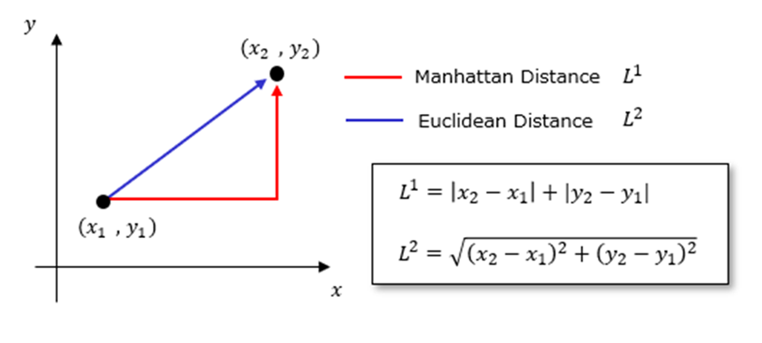
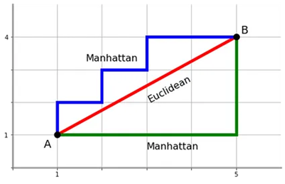

# Final Review Session
## 1. Machine Learning Concepts
### a. Data Overview

The data provided for the following questions includes information about 6 individuals, categorized by their happiness status (Happy/Unhappy). The features we know about each person are:

| Happy/Unhappy | Income (dollars) | Distance from North Pole (miles) | Continents Visited | Age |
|---------------|------------------|----------------------------------|---------------------|-----|
| Happy         | 10k              | 4k                               | Europe              | 25  |
| Happy         | 30k              | 10k                              | Europe              | 19  |
| Happy         | 90k              | 5k                               | Europe              | 26  |
| Unhappy       | 100k             | 1k                               | Europe              | 57  |
| Unhappy       | 120k             | 1k                               | Europe              | 60  |
| Unhappy       | 60k              | 6k                               | Europe              | 40  |

###  b. Questions to Answer

1. **Using the Manhattan Distance and looking only at "Income" and "Distance from North Pole", which two people are closest and farthest?**

2. **If we were to cluster the people, the inclusion/exclusion of which feature would never impact the final clusters?**

### c. Distance Metrics

### Visual Representation:

  
  

## d. Manhattan Distance Calculations

Here are the calculations of Manhattan distance between each pair of individuals based on "Income" and "Distance from North Pole":

  
Click to view Manhattan distance calculations

- **Person 1 vs Person 2:**  
  |10k - 30k| + |4k - 10k| = 20k + 6k = 26k
- **Person 1 vs Person 3:**  
  |10k - 90k| + |4k - 5k| = 80k + 1k = 81k
- **Person 1 vs Person 4:**  
  |10k - 100k| + |4k - 1k| = 90k + 3k = 93k
- **Person 1 vs Person 5:**  
  |10k - 120k| + |4k - 1k| = 110k + 3k = 113k
- **Person 1 vs Person 6:**  
  |10k - 60k| + |4k - 6k| = 50k + 2k = 52k
- - **Person 2 vs Person 3:**  
  |30k - 90k| + |10k - 5k| = 60k + 5k = 65k
- **Person 2 vs Person 4:**  
  |30k - 100k| + |10k - 1k| = 70k + 9k = 79k
- **Person 2 vs Person 5:**  
  |30k - 120k| + |10k - 1k| = 90k + 9k = 99k
- **Person 2 vs Person 6:**  
  |30k - 60k| + |10k - 6k| = 30k + 4k = 34k

- **Person 3 vs Person 4:**  
  |90k - 100k| + |5k - 1k| = 10k + 4k = 14k
- **Person 3 vs Person 5:**  
  |90k - 120k| + |5k - 1k| = 30k + 4k = 34k
- **Person 3 vs Person 6:**  
  |90k - 60k| + |5k - 6k| = 30k + 1k = 31k

- **Person 4 vs Person 5:**  
  |100k - 120k| + |1k - 1k| = 20k + 0k = 20k
- **Person 4 vs Person 6:**  
  |100k - 60k| + |1k - 6k| = 40k + 5k = 45k

- **Person 5 vs Person 6:**  
  |120k - 60k| + |1k - 6k| = 60k + 5k = 65k

## e. Answer to Clustering Question

### Impact of Feature Exclusion:

  
Click to view answer

  In this case, the feature "Continents Visited" would not impact the final clusters. Since all individuals in this dataset have visited only Europe, there's no variation in this feature.

