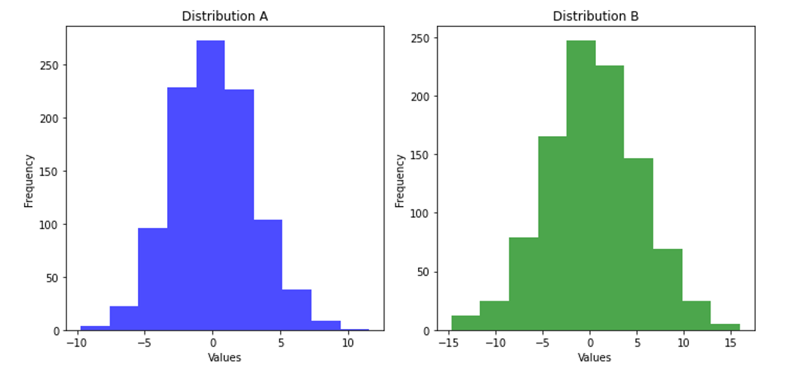
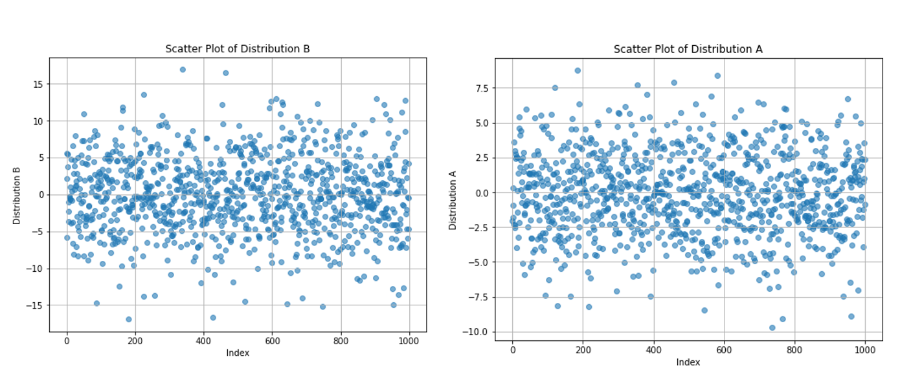

# Final Review Session
## 1. Machine Learning Concepts
### a. Data Overview

The data provided for the following questions includes information about 6 individuals, categorized by their happiness status (Happy/Unhappy). The features we know about each person are:

| Happy/Unhappy | Income (dollars) | Distance from North Pole (miles) | Continents Visited | Age |
|---------------|------------------|----------------------------------|---------------------|-----|
| Happy         | 10k              | 4k                               | Europe              | 25  |
| Happy         | 30k              | 10k                              | Europe              | 19  |
| Happy         | 90k              | 5k                               | Europe              | 26  |
| Unhappy       | 100k             | 1k                               | Europe              | 57  |
| Unhappy       | 120k             | 1k                               | Europe              | 60  |
| Unhappy       | 60k              | 6k                               | Europe              | 40  |

###  b. Questions to Answer

1. **Using the Manhattan Distance and looking only at "Income" and "Distance from North Pole", which two people are closest and farthest?**

2. **If we were to cluster the people, the inclusion/exclusion of which feature would never impact the final clusters?**

### c. Distance Metrics

### Visual Representation:

  
  

## d. Manhattan Distance Calculations

Here are the calculations of Manhattan distance between each pair of individuals based on "Income" and "Distance from North Pole":

  
Click to view Manhattan distance calculations

- **Person 1 vs Person 2:**  
  |10k - 30k| + |4k - 10k| = 20k + 6k = 26k
- **Person 1 vs Person 3:**  
  |10k - 90k| + |4k - 5k| = 80k + 1k = 81k
- **Person 1 vs Person 4:**  
  |10k - 100k| + |4k - 1k| = 90k + 3k = 93k
- **Person 1 vs Person 5:**  
  |10k - 120k| + |4k - 1k| = 110k + 3k = 113k
- **Person 1 vs Person 6:**  
  |10k - 60k| + |4k - 6k| = 50k + 2k = 52k
- - **Person 2 vs Person 3:**  
  |30k - 90k| + |10k - 5k| = 60k + 5k = 65k
- **Person 2 vs Person 4:**  
  |30k - 100k| + |10k - 1k| = 70k + 9k = 79k
- **Person 2 vs Person 5:**  
  |30k - 120k| + |10k - 1k| = 90k + 9k = 99k
- **Person 2 vs Person 6:**  
  |30k - 60k| + |10k - 6k| = 30k + 4k = 34k

- **Person 3 vs Person 4:**  
  |90k - 100k| + |5k - 1k| = 10k + 4k = 14k
- **Person 3 vs Person 5:**  
  |90k - 120k| + |5k - 1k| = 30k + 4k = 34k
- **Person 3 vs Person 6:**  
  |90k - 60k| + |5k - 6k| = 30k + 1k = 31k

- **Person 4 vs Person 5:**  
  |100k - 120k| + |1k - 1k| = 20k + 0k = 20k
- **Person 4 vs Person 6:**  
  |100k - 60k| + |1k - 6k| = 40k + 5k = 45k

- **Person 5 vs Person 6:**  
  |120k - 60k| + |1k - 6k| = 60k + 5k = 65k

## e. Answer to Clustering Question

### Impact of Feature Exclusion:

  
Click to view answer

  In this case, the feature "Continents Visited" would not impact the final clusters. Since all individuals in this dataset have visited only Europe, there's no variation in this feature.

---

## 2. Multiple Choice Question: Normal Distributions

Consider two normal distributions, A and B. The standard deviation of A is 3, and the standard deviation of B is 5. For each distribution, 1,000 observations are drawn and plotted in a histogram with 10 bins, creating one histogram for each distribution.

### Question:
Which of the following statements about the histograms is true?

1. The rightmost bin of A will have fewer points than the rightmost bin of B.
2. The rightmost bin of B will have fewer points than the rightmost bin of A.
3. The rightmost bin of A will have the same number of points as the rightmost bin of B.
4. Any of the above are possible.
   

  
Click to view answer

### Visual Explanation:

Here are two plots to visualize the distributions:

1. **Histogram**

 

  

2. **Scatter Plot**

 

  

### Answer:
In this case, we cannot definitively determine how many points will fall into the rightmost bin of each distribution without further information about the mean or specific values of the distributions. Therefore, any of the above options are indeed possible.

Any of the given statements could be possible due to randomness in the data and the probabilistic nature of normal distributions.

---

## 3. Multiple Choice Question: Estimating Mean and Standard Deviation

You want to calculate confidence intervals by applying the empirical rule, which requires that you have a normal distribution with a known mean and standard deviation. Which approach can you use to estimate the mean and standard deviation that you need? Choose all that work.

### Options:
1. Central Limit Theorem, which requires that you have many sufficiently large samples from the population.
2. Standard Error, which requires that you have one sufficiently large sample.

  
Click to view answer

### Answer:
- **Central Limit Theorem** (Option 1): This works because the Central Limit Theorem tells us that if we have many sufficiently large samples from a population, the sampling distribution of the sample mean will approach a normal distribution. It allows us to estimate the population mean and standard deviation.

- **Standard Error** (Option 2): This works because the standard error of the sample mean gives us an estimate of the variability of the sample mean. If you have one sufficiently large sample, you can use it to estimate the population parameters and calculate confidence intervals.

### Correct Answers:
- **1. Central Limit Theorem**
- **2. Standard Error**

