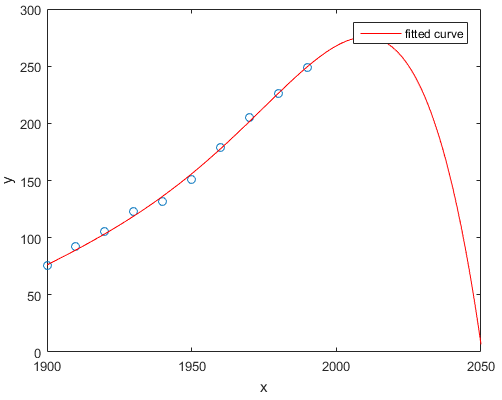

### Problem 1-1: Probability of a Coin Flip

Consider deriving the probability of a coin flip coming up heads by running m trials of 100 flips each. If the coin is fair, the mean probability of the m trials will go to 0.5 as m goes to infinity.

- True
- False

  
Answer

  
  **True:** 
  As the number of trials (`m`) increases, the mean probability of flipping heads will converge to 0.5 for a fair coin due to the **Law of Large Numbers**.

---

### Problem 1-2: Fairness of a Weighted Die

You roll an unfair (weighted) die. The distribution of the numbers rolled is a uniform distribution.

- True
- False

  
Answer

  
  **False:** 
 An unfair die is not uniformly distributed. A uniform distribution means that every outcome has an equal probability, but a weighted die would have different probabilities for each outcome.

---

### Problem 1-3: Simulation Usefulness

A simulation:

- is useful when describing a system that cannot easily be described mathematically.
- is easy to successively refine.
- can be used to extract intermediate results.
- All of the above
- None of the above

  
Answer

  
  **All of the above:** 
  Explanation: Simulations are versatile tools used for modeling complex systems, refining models iteratively, and extracting intermediate or real-time results when analytical solutions are not available.

---

### Problem 1-4: Overfitting vs Underfitting

The following image plots the population of the US over time, along with a model fit to the data. This is an example of points linearly from 1900 to 2000 and a red line fitted to the points that dips to 0 from x=2000 to x=2050.

  

- overfitting
- underfitting
- Neither of the above

  
Answer

  
  **overfitting:** 
  Explanation: The model is overly complex and fits the noise in the data (bends to zero after 2000), which is characteristic of overfitting.

---

### Problem 1-5: Linear Regression and R-squared

If the R-squared of a model produced using linear regression is 0.7, the model accounts for 70% of the variance in the observations.

- True
- False

  
Answer

    
  **True:** 
  R-squared represents the proportion of variance in the dependent variable that is explained by the independent variables in the model. A value 
  of 0.7 means 70% of the variance is explained.

---

### Problem 1-6: Polynomial Fit

Given a finite set of data points, there exists a polynomial fit such that the polynomial curve goes through each point in the data.

- True
- False

  
Answer

  
  **False:** 
  While it is possible to fit a polynomial to pass through every data point, it is generally undesirable, especially with noisy data, as it leads to overfitting. A model that fits the data too closely may fail to generalize to new data.

